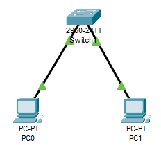
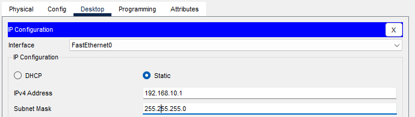
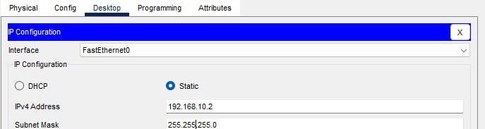
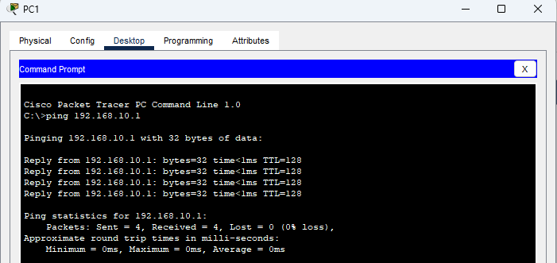
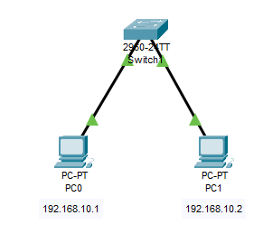
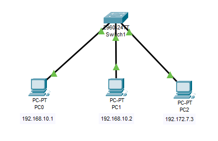
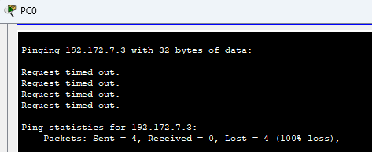

- PDU: protocol data unit
    - name for: bit, segment, packet, frame


<details>
<summary><b>LLM Query:</b> what is PDU?</summary>

A Protocol Data Unit (PDU) is a specific block of data transferred between peer entities at a single layer of a networking model (such as OSI or TCP/IP). It consists of protocol-control information (headers and trailers) combined with the user payload passed down from the layer above.

As data travels down the network stack during transmission, each layer encapsulates the payload with its own control metadata, assigning the PDU a distinct name at each stage.

| OSI Layer | Layer Name | Protocol Data Unit (PDU) | Key Identification |
| --- | --- | --- | --- |
| **Layers 7–5** | Application, Presentation, Session | **Data / Message** | User/Application protocols (HTTP, SSH) |
| **Layer 4** | Transport | **Segment** (TCP) / **Datagram** (UDP) | Source and Destination Ports |
| **Layer 3** | Network | **Packet** | IP Addresses |
| **Layer 2** | Data Link | **Frame** | MAC Addresses |
| **Layer 1** | Physical | **Bits** | Binary pulses/voltages |

**Anatomy of a PDU**

* **Header:** Metadata appended to the front of the payload containing instructions such as source/destination addresses, sequencing numbers, and protocol parameters.
* **Payload (SDU):** The Service Data Unit—the raw data payload delivered from the adjacent higher layer.
* **Trailer:** Verification metadata appended to the end of the payload, primarily used at Layer 2 for error detection (e.g., Frame Check Sequence).

Upon reaching its destination, the process reverses (decapsulation). Each layer reads its header, processes the instructions, strips the header/trailer, and passes the remaining payload up to the next higher layer.

</details>


# recap

## 8 bit 

- 32-bit => $2^{32}$ addresses

- MAC address has 48 bits
- 1st 24 (OUI): Organizationally Unique Identifier (assigned by IEEE to identify vendor)
- last 24 (NIC specific): Network Interface Controller identifier, assigned by vendor to indentify specific device

## broadcast
- 1 PC sends to all others 


## subnet mask
- used to seperate Network and Host bits
- NB -> 1
- HB -> 0

```
e.g: 192.168.10.4 -> class C
      N   N  N  H
      1   1  1  0

subnet: 255.255.255.0
```

```
e.g: 10.0.0.4 -> class A

NID: 10.0.0.0
HID:  0.0.0.4
```

# lab 2

- if 2 pc are of the same network they have the same network ID
- same network -> switch
- diff   "     -> router

- for connecting two devices with cable:
1. straight-through
    1. for connecting different devices
2. crossover
    1. "    "           same        "


- switch
    - pc0 -> ip: 192.168.10.1
    - pc1 -> ip: 192.168.10.2 (both are on the same _network_ (they have the same NID) )
             (ip: 10.168.10.2, diff network from pc0)




- opening pc0


- `192.168.10.1` class C with subnet present in image

- pc1


- pc1 pinging to pc0



- `ping` cmd uses ICMP


- adding note...



- 3rd device on different network ID is not responding





https://gemini.google.com/share/d/1oEJdWuY2lR6hx8fNxGvpuFNBemognMAT?usp=sharing

