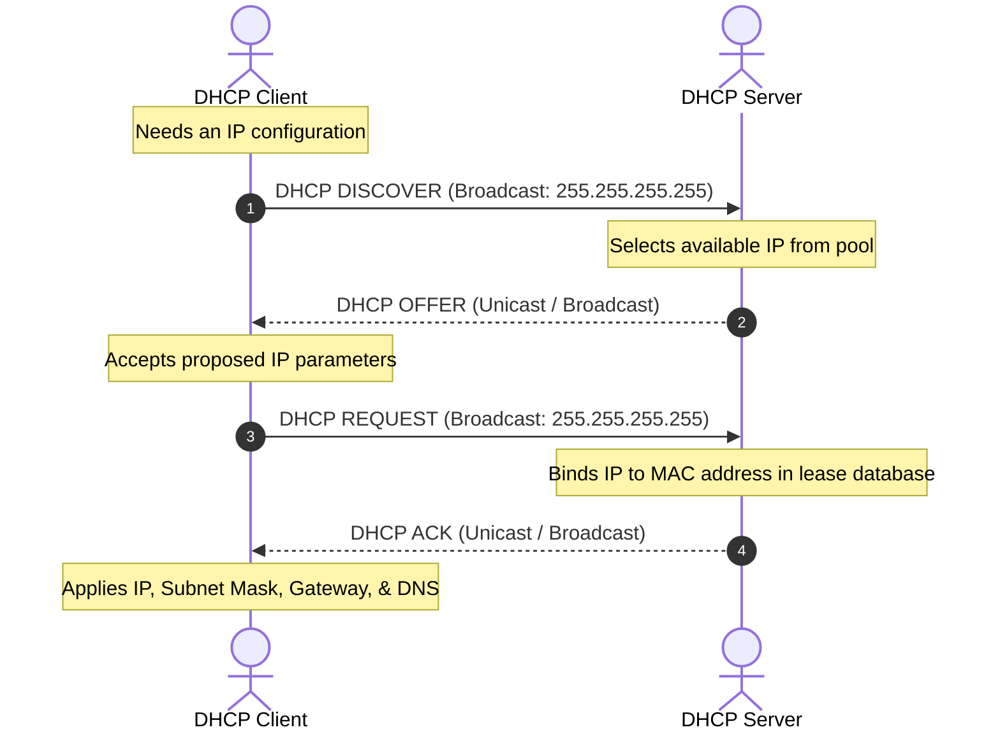
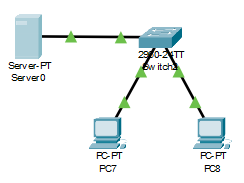
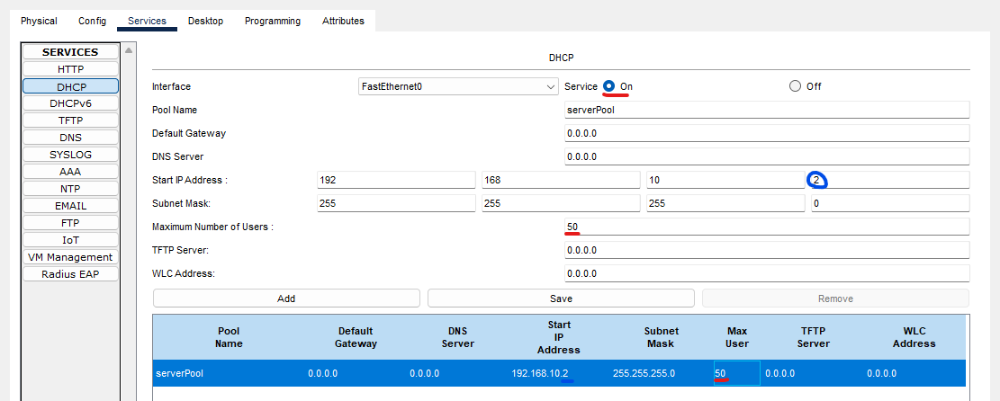
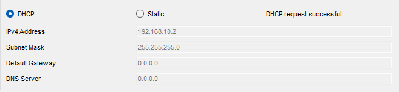
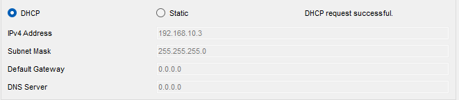

https://gemini.google.com/share/d/1oEJdWuY2lR6hx8fNxGvpuFNBemognMAT?usp=sharing


- PDU: protocol data unit
    - name for: bit, segment, packet, frame


<details>
<summary><b>LLM Query:</b> what is PDU?</summary>

A Protocol Data Unit (PDU) is a specific block of data transferred between peer entities at a single layer of a networking model (such as OSI or TCP/IP). It consists of protocol-control information (headers and trailers) combined with the user payload passed down from the layer above.

As data travels down the network stack during transmission, each layer encapsulates the payload with its own control metadata, assigning the PDU a distinct name at each stage.

| OSI Layer | Layer Name | Protocol Data Unit (PDU) | Key Identification |
| --- | --- | --- | --- |
| **Layers 7–5** | Application, Presentation, Session | **Data / Message** | User/Application protocols (HTTP, SSH) |
| **Layer 4** | Transport | **Segment** (TCP) / **Datagram** (UDP) | Source and Destination Ports |
| **Layer 3** | Network | **Packet** | IP Addresses |
| **Layer 2** | Data Link | **Frame** | MAC Addresses |
| **Layer 1** | Physical | **Bits** | Binary pulses/voltages |

**Anatomy of a PDU**

* **Header:** Metadata appended to the front of the payload containing instructions such as source/destination addresses, sequencing numbers, and protocol parameters.
* **Payload (SDU):** The Service Data Unit—the raw data payload delivered from the adjacent higher layer.
* **Trailer:** Verification metadata appended to the end of the payload, primarily used at Layer 2 for error detection (e.g., Frame Check Sequence).

Upon reaching its destination, the process reverses (decapsulation). Each layer reads its header, processes the instructions, strips the header/trailer, and passes the remaining payload up to the next higher layer.

</details>


# recap

## 8 bit 

- 32-bit => $2^{32}$ addresses

- MAC address has 48 bits
- 1st 24 (OUI): Organizationally Unique Identifier (assigned by IEEE to identify vendor)
- last 24 (NIC specific): Network Interface Controller identifier, assigned by vendor to indentify specific device

## broadcast
- 1 PC sends to all others 


## subnet mask
- used to seperate Network and Host bits
- NB -> 1
- HB -> 0

```
e.g: 192.168.10.4 -> class C
      N   N  N  H
      1   1  1  0

subnet: 255.255.255.0
```

```
e.g: 10.0.0.4 -> class A

NID: 10.0.0.0
HID:  0.0.0.4
```

# lab 2

- if 2 pc are of the same network they have the same network ID
- same network -> switch
- diff   "     -> router

- for connecting two devices with cable:
1. straight-through
    1. for connecting different devices
2. crossover
    1. "    "           same        "


- switch
    - pc0 -> ip: 192.168.10.1
    - pc1 -> ip: 192.168.10.2 (both are on the same _network_ (they have the same NID) )
             (ip: 10.168.10.2, diff network from pc0)


- opening pc0


- `192.168.10.1` class C with subnet present in image

- pc1


- pc1 pinging to pc0


- `ping` cmd uses ICMP


- adding note...


- 3rd device on different network ID is not responding


## DHCP 
- DHCP used for auto IP assignment
    - dynamic host configuration protocol
- DORA process: four-step interaction used by DHCP to assign IP address, subnet mask, default gateway, and DNS parameters to a network client



- Lease time: duration of dynamic IP

### configing DHCP using server in cisco packet tracer



- give server0 `192.168.10.1` (static IP)
- for DHCP give starting addr. `192.168.10.2` (to prevent conlflict)



- checking pc7



- pc8



- ARP: resolves IP with MAC
    - address resolution protocol
- Reverse-ARP:  resolves MAC with IP

<details>
<summary><b>Query:</b> what is ARP? </summary>

**Address Resolution Protocol (ARP)** is a network protocol used to map a device's logical IP address (Layer 3) to its physical MAC address (Layer 2) on a local network.

**How ARP Works**

* **ARP Request:** When a device wants to communicate with an IP on the local network but lacks its physical address, it sends a broadcast frame asking, *"Who has IP 192.168.1.50? Tell 192.168.1.10."*
* **ARP Reply:** The device matching that IP address responds directly (unicast) with its hardware address: *"192.168.1.50 is at 00:1A:2B:3C:4D:5E."*
* **ARP Cache:** The requesting device stores the IP-to-MAC pair in a temporary local table so it doesn't have to repeat the request for every single packet sent.


</details>


- switch is a smart device (not dumb device)
- it maintains mac address Table

<details>
<summary><b>Query:</b> is switch a smart device?</summary>

Yes, a network switch is considered a "smart" device—especially when compared to a network hub—because it reads incoming data frames and intelligently forwards them only to the specific port connected to the destination device.

**Why a Switch is "Smart"**

* **MAC Address Learning:** Automatically builds and updates a **MAC Address Table** (CAM table) by observing the source addresses of incoming frames to map which physical device is on which port.
* **Targeted Forwarding:** Instead of flooding data to every port, it forwards unicast traffic directly to the specific destination port, saving bandwidth and improving privacy.
* **Collision Prevention:** Operates in full-duplex mode, allowing devices to transmit and receive data simultaneously without network packet collisions.

**Levels of Switch "Intelligence"**

| Device Type | Intelligence Level | How Traffic is Handled |
| --- | --- | --- |
| **Hub** | "Dummy" (Layer 1) | Re-transmits all incoming bits to every connected port indiscriminately. |
| **Unmanaged Switch** | Smart (Layer 2) | Plug-and-play; automatically routes frames based on MAC addresses, but cannot be configured. |
| **Managed / Smart Switch** | Advanced (Layer 2 / Layer 3) | Configurable; supports VLANs, Quality of Service (QoS), security access lists, and remote management. |

</details>

