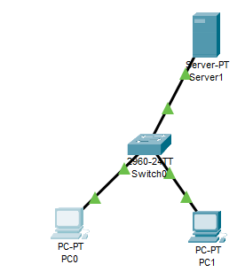
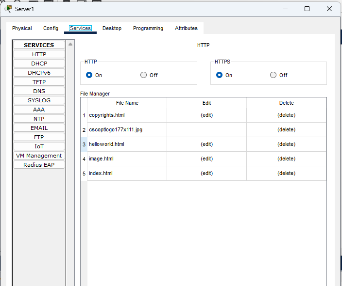

## ipv6

- 128 bits
- 8 groups

### ipv6 shorthand

- `1292:0000:0000:0092`
- `1292::92`

x:0:0:0:x:0:0:0

- 0000:0000:2001:0000:0000:8a2e:0370:7334
- :2001:0:0:8a2e:370:7334

<b>Query:</b> now for local host we only use 127.0.0.1 is it true that i can use all 127.x.x.x

Yes, it is true. The entire **127.0.0.0/8** block (over 16.7 million addresses from `127.0.0.1` to `127.255.255.254`) is reserved by RFC 1122 for internal host loopback.

While `127.0.0.1` is the standard convention, operating system TCP/IP stacks treat any IP starting with `127.` as traffic destined for the local machine. You can test this right now by opening a terminal and running `ping 127.42.12.99`—it will respond just like `127.0.0.1`.

**Why This Is Useful**

* **Avoid Port Conflicts:** If you are running multiple local microservices or web servers that all want to use port `80` or `8080`, you can bind Service A to `127.0.0.2:80` and Service B to `127.0.0.3:80` without changing ports.
* **Multi-Tenant Testing:** You can simulate different local clients, microservices, or database nodes on distinct local IP addresses without needing virtual machines or containers.
* **Custom Hosts Mapping:** You can map multiple local domain names in your `hosts` file to different `127.x.x.x` addresses for cleaner local development.

**A Few Caveats**

* **Reserved Ends:** `127.0.0.0` represents the network ID and `127.255.255.255` is the loopback broadcast address, so avoid using those two.
* **Application Binding:** If a service explicitly listens on `127.0.0.1` instead of `0.0.0.0` (all interfaces) or a specific `127.x.x.x` IP, it won't receive traffic sent to `127.0.0.2`.

# lab 

- switch works in datalink
- switch for successful communication needs MAC, otherwise it broadcasts all the messages
- it creates a MAC address table (CAP)
- 

## fetching html file from a server in packet tracer

1. open `index.html` in server services, edit it
2. go to web browser tool in pc
3. go to server ip -> `http://192.168.x.x`
4. view the html file

